# Informe

## Integrantes
- Cristian Ariel Muñoz

## Instalación de Spark en una computadora personal
Se comenzo preguntando a chatGPT sobre como se puede instalar Spark, el cual dio una serie de pasos para hacerlo. Los cuáles segui e hice lo que me faltaba de los pasos. Los pasos son los siguientes:

Tuve problemas con lo de setear las variables de entorno. Es decir con hacer que pueda iniciar Spark desde cualquier parte. Le pregunte a chatGPT como podia hacerlo y me respondio lo siguiente:

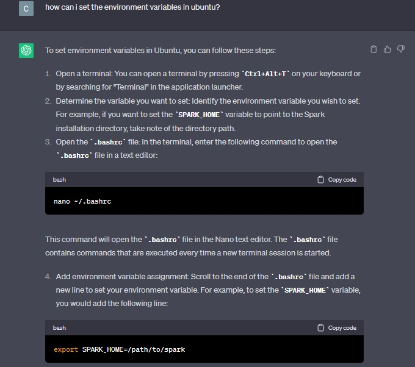
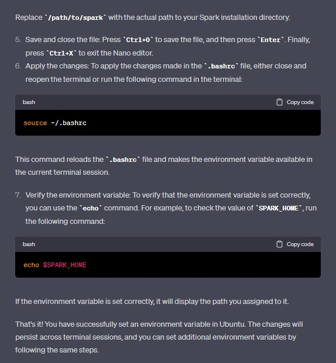

De aca pude hacer la variable de entorno para el bashrc, pero el comando "spark-shell" seguia sin funcionarme por lo que busque en internet y encontre la siguiente página que me espeficaba como agregar un directorio al PATH de forma permanente.

https://pimylifeup.com/ubuntu-add-to-path/

Luego con esto pude verificar la instalación viendo que el comando "spark-shell" funcionaba.

## Estructura de un programa en Spark
Un programa de Spark, según chatGPT, tiene la siguiente estructura:

- SparkSession: Es donde comenzamos para hacer cualquier funcionalidad de Spark. Creamos la clase SparkSession para luego poder hacer DataFrames, acceder a la API de Spark, etc..

- Data Input: Cargar o crear input data, ya sea leer desde archivos o conectar con fuentes externas.

- Data Transformation: Spark provee un conjunto de operaciones para manipular y transformar el input data en el formato deseado. Las transformaciones no son ejecutadas directamente, sino que son guardadas como un grafo aclicico directo (DAG).

- Actions: Activan las ejecuciones del DAG. Las acciones producen resultados o escriben data a sistemas de almacenamiento externo. 

- Spark Context: Para crear RDDs (Datasets distribuidos resilentes). Ahora es automáticamente creado cuando hacemos la clase SparkSession.

- Configuration: Los programas Spark comúnmente incluyen configuraciones para controlar varios áspectos del comportarmiento de Spark.

- Error Handling: Es crucial para manejar errores y excepciones.

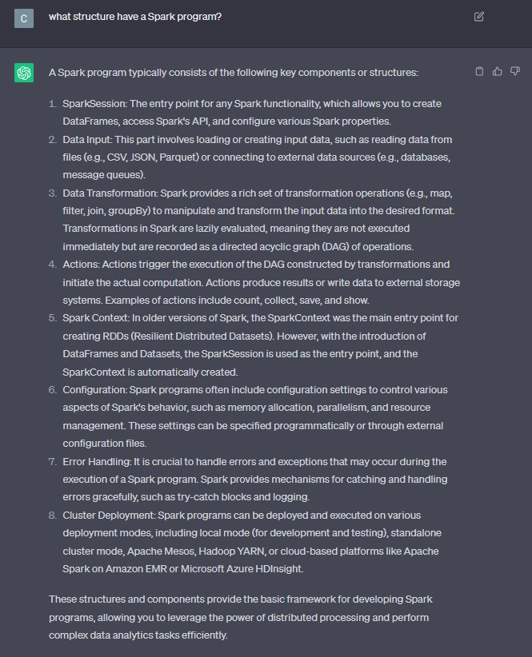

## Estructura de un programa de conteo de palabras en diferentes documentos en Spark

La estructura de un programa de conteo de palabras en Spark, según chatGPT, tiene la siguiente en estructura:

- Preparar el SparkContext.

- Cargar los datos de entrada.

- Transformar los datos y se limpia (eliminar puntuación, hacer todo a minúscula).

- Contador de palabras, los datos transformados son procesados para hacer el conteo. Este paso involucra mappear cada palabra a un par valor-clave. Spark provee "map" y "recudeByKey" para hacer eficientemente este conteo entre datasets distribuidos.

- Agregando los contadores de palabras, las palabras obtenidas en el paso previo están distrubidas entre múltiples particiones o nodos en el Spark cluster. Para obtener un contador de palabras consolidado, el programa tiene que tener un paso de agregación usando operaciones como "reduce" o "fold". 

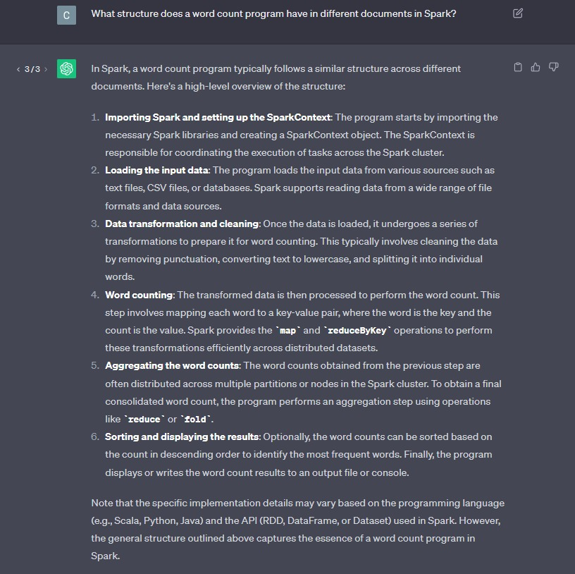

## Adaptar el código del LAB02 a la estructura del programa objetivo en Spark

- Las subscription se mantiene igual ya que no cambia la forma de leer el formato del mismo.
 
- El httpRequest se mantiene igual porque Spark no tiene ninguna funcionalidad para obtener datos de páginas web 

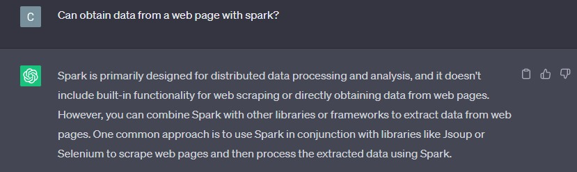

- Feed se mantienen igual porque es la forma de guardar la información.
  
- Article se modificó, agregado métodos para poder trabajar con Spark, entre ellos el addNamedEntity y getListNamedEntities. Además de que ahora el método de computedNamedEntities se encarga de computar las entidades nombradas por artículo.

- Los Parsers se mantienen igual porque Spark no tiene ninguna funcionalidad para parsear fácilmente de la forma que necesitamos. No hay una forma directa de parsear xml con Spark, por lo tanto tendríamos que usar las clases y métodos que tenemos, y modificando para que funcione con los métodos de RDD.

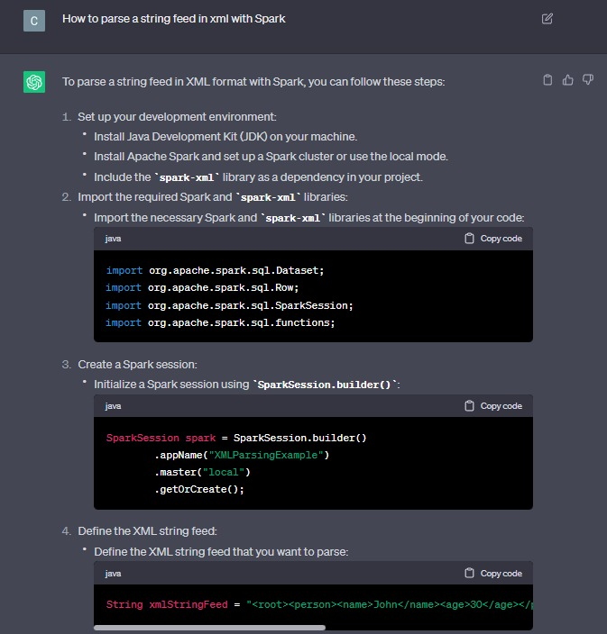

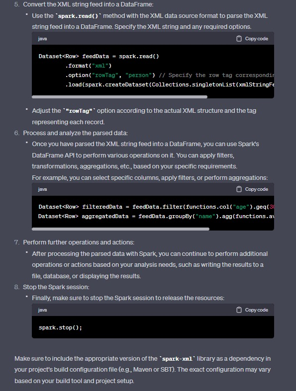

- Las heurísticas se cambiaron, ahora no hace falta llamar al main de una heurística para computar las entidades nombradas. Se borro los main de cada heurística.

- Se hizo en el archivo FeedReader el adaptamiento del código a Spark, solamente para cuando obtenemos las entidades nombradas: 

  1. Se creo y configuro un SparkContext, luego se creo un JavaRDD (Resilent Distributed Datasets) usando la data (los artículos).
  
    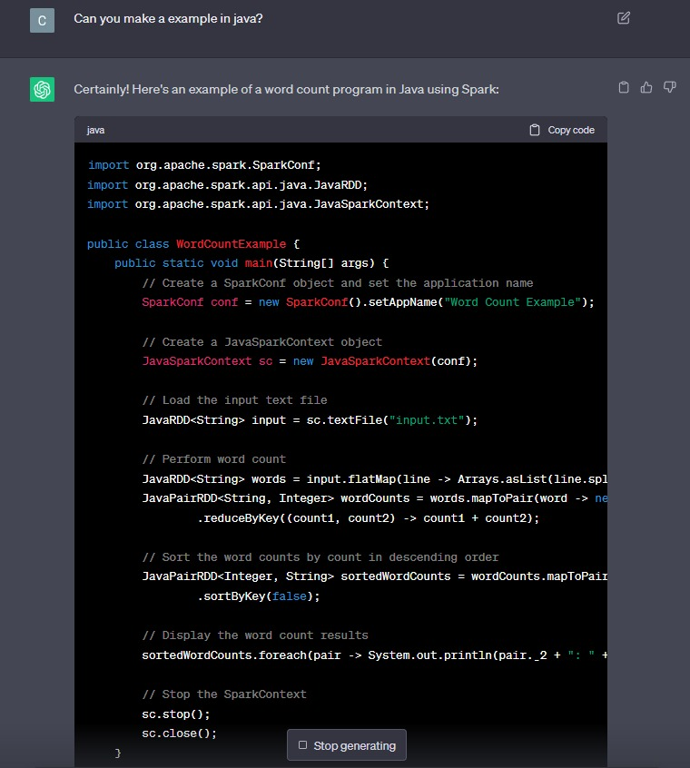

    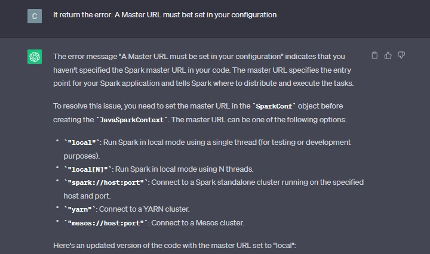

    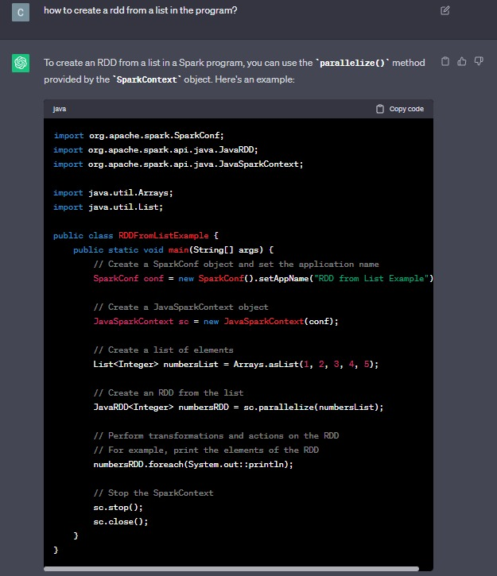
  
  2. Transformamos la data mediante el uso de los métodos map y flatMap de RDD y los métodos de nuestros programas. Se uso como ayuda principalmente la siguiente página con ejemplo y explicaciones de Spark en Scala: https://sparkbyexamples.com . Usando principalmente las explicaciones de como funcionan los métodos de RDD.
  
  3. Luego hicimos el conteo de palabras similar a como está en el ejemplo de ChatGPT.
  
  4. Por último imprimimos por pantalla el los resultados finales.

Tuve dificultades con algunas parte de Spark que se resolvían rápidamente con una consulta a ChatGPT o buscando en la página mencionada anteriormente. Lo que más me llevo tiempo fue el error de "task not seriallizable" que pregunto a chatGPT y googleando un poco encontre que tenia que hacer que todas los objetos que fueran usados por RDD sean instanciados de clases que implementen "Seriallizable", para poder hacer el trabajarlo de forma paralela.

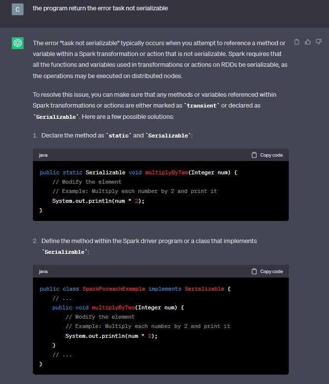

## Integrar estructura orientada a objetos con la estructura funcional de map-reduce

Se tiene que usar métodos que tengan similitudes con las funciones, como por ejemplo devolver algo. Para poder usar los map o flatMap tuve que cambiar los métodos que usaba para que en vez modificara (que funcione como procedimiento) que devolviera el lo que necesitara para asi los métodos map pudieran funcionar. 

Luego para el caso del map-reduce tuvimos que importar las tuplas de scala para poder hacer tuplas con un número representando el contador y usar reduceByKey para que simplemente queden los nombres o categorias una vez con el número de veces que se repiten.

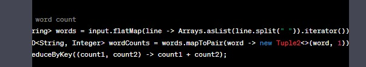

