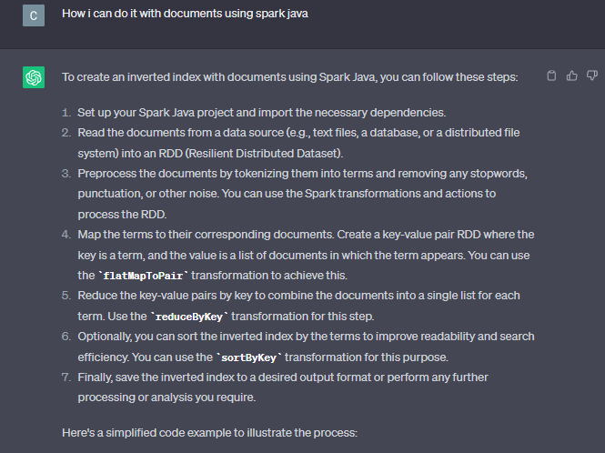
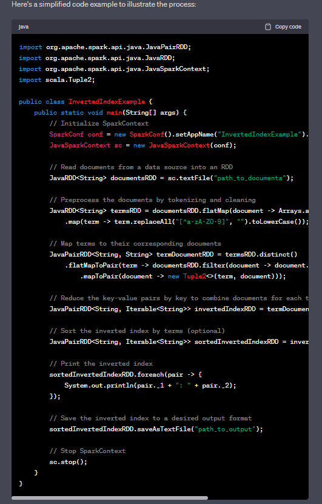
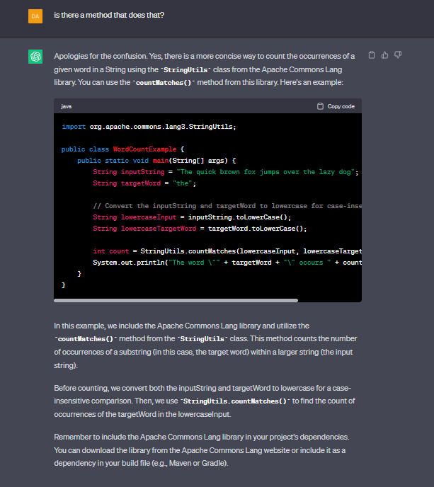

# INFORME LABORATORIO GRUPAL

### Elección de la Solución

Optamos por continuar trabajando con el laboratorio de Santiago Torres debido a que es el mas completo, ya que presenta una interfaz de usuario, lo que lo hace más amigable.
Además, la modularizacion a partir de un handler, nos brinda una mejor comodidad ya sea a la hora de arreglar algun problema/agregar funcionalidad extra (si bien en los laboratorios de Cristian y Damián tambien presentan este tipo de modularización, no generalizan la obtención de los feeds, pues se realiza antes de cada consulta y no al principio del programa).

Por otro lado se utiliza **Gradle**, lo cual a través de la herramienta de **Gradle Wrapper** nos permite ejecutar el programa en cualquier maquina, sin necesidad de instalar **Gradle** anteriormente, con el siguiente comando:

```bash
./Gradlew run
```

De la implementación de Damián Feigelmüller decidimos implementar la manera de organizar las herencias, aprovechando que GeneralParser es una clase abstracta. Asi definimos un metodo `parse()` para cada Parser el cual se encarga de pasar el string obtenido del `Requester` y devolver directamente un objecto `Feed`.

### Recuperación de Documentos por Palabras Claves

Esta funcionalidad ya estaba implementada en el laboratorio elegido, pero a medias, por lo que decidimos rehacerla utilizando **Índice Invertido**.

Para entender este concepto, nos guiamos con [esta página](https://www.geeksforgeeks.org/inverted-index/), y para la implentación del código le consultamos a ChatGPT:





Primero, le pedimos al usuario que escriba las palabras claves, utilizamos toLowerCase() para no tener en cuenta las mayusculas.

```Java
String keyword = scan.nextLine().toLowerCase();
```

Luego, del RDD (Resilient Distributed Dataset) de articulos mapeamos cada articulo a una tupla en donde el primer elemento es un entero represetando la cantidad de veces que se repiten las palabras en el texto del articulo, y el segundo el articulo en si utilizando `mapToPair()`. Para contar las ocurrencias de las palabras utilizamos el metodo `countMatches()`



```Java
.mapToPair(article -> new Tuple2<>(StringUtils.countMatches(article.getText(), keyword), article))
```

Después, agrupamos con `groupByKey()` (se reducen) las tuplas según la cantidad ocurrencias de las palabras, es decir, el resultado es un RDD con tuplas en donde el primer elemento sigue siendo la cantidad de ocurrencias y el segundo pasa a ser una lista de los articulos con esa cantidad de ocurrencias en el texto.

```Java
.groupByKey()
```

Por último, se quitan las tuplas con cero ocurrencias de las palabras claves con `filter()` y se el resto se ordenan de forma ascendente (de mayor a menor) utilizando `sortByKey()` con el parametro `True`.

```Java
.filter(tuple -> tuple._1 != 0)
.sortByKey(true);
```

Cabe destacar que aunque mencionamos que se buscan varias palabras claves, solo funciona si aparecen en el mismo orden, por ejemplo:
Si el input es "Elon Musk", solo encontrará articulos que tengan expresión exacta, y no los que solo tengan "Elon" ó "Musk".
